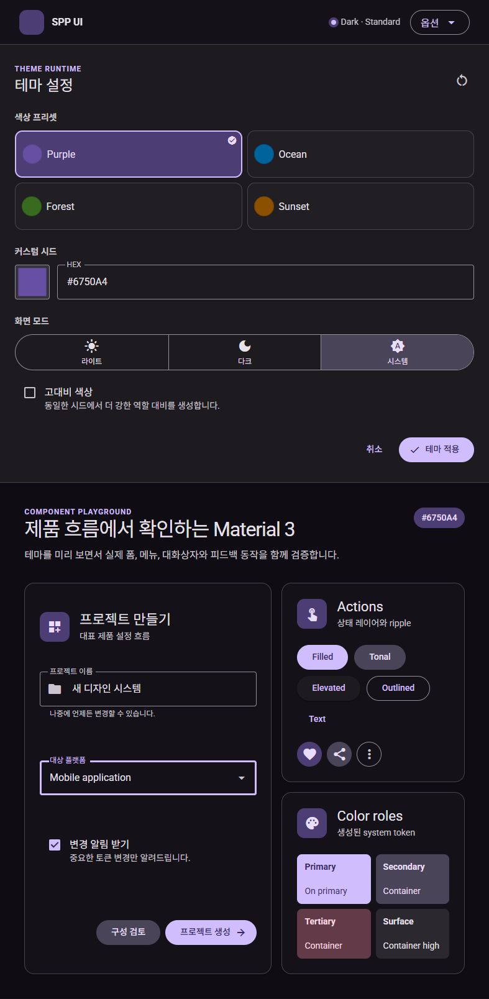
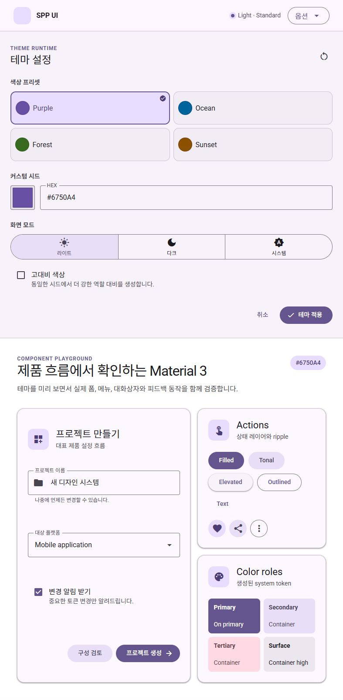
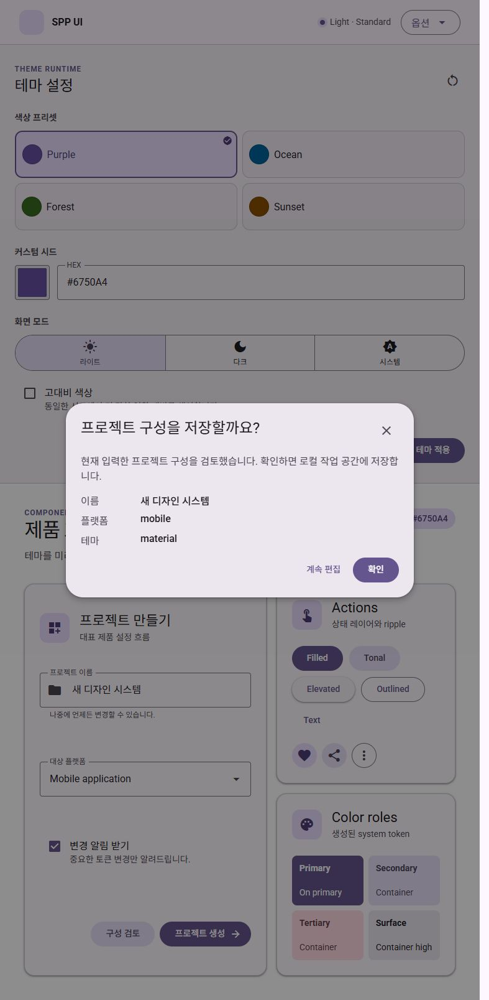
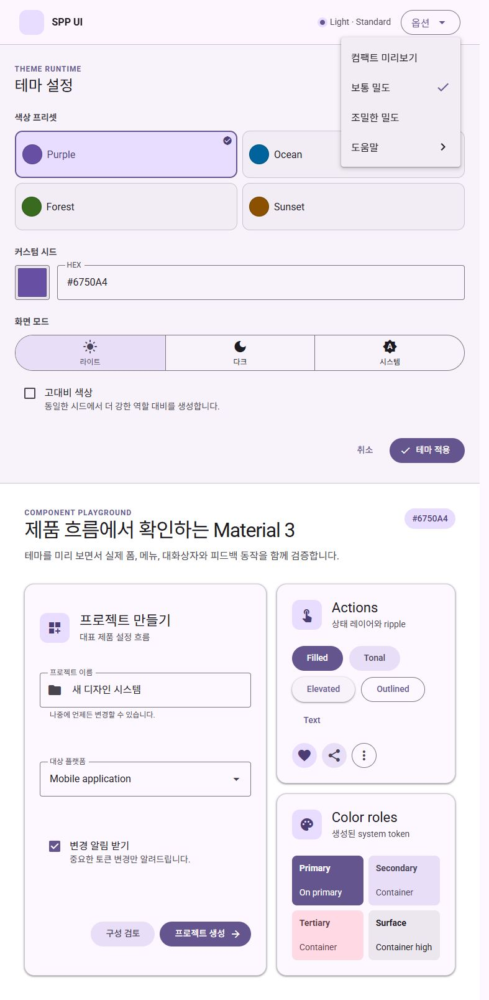
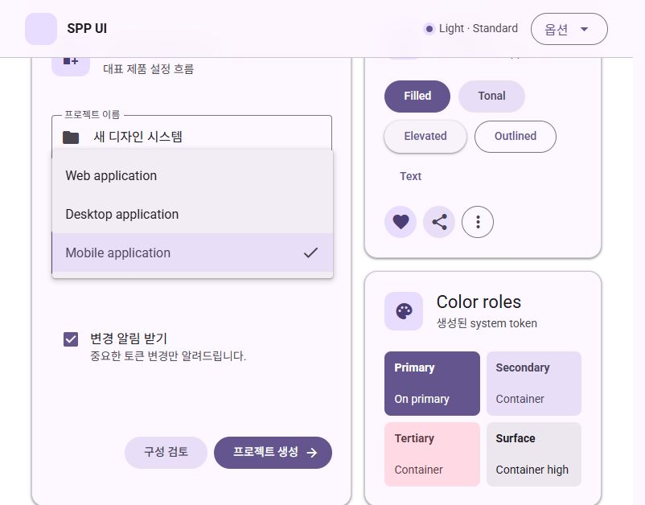
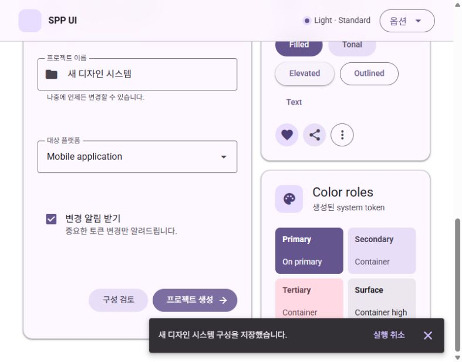

# MD3 / Material Web 컴포넌트 정합성 감사

- 관찰일: 2026-08-25
- 대상: `Button`, `IconButton`, `TextField`, `Checkbox`, `Select`, `Dialog`, `Menu`, `Snackbar`
- 기준: Material Design 3, Material Web `docs@main`, Material Web v2.5.0 snapshot `b4de401eb665ec63474f39319a4ba8f2145974cc`
- 범위: anatomy, size, color, typography, shape, elevation, state, ripple, focus, motion, accessibility, token graph

## 결론

전체 판정은 `BLOCKED`다. 구현된 8개 컴포넌트는 대표 흐름에서 동작하지만, MD3/Material Web과의 시각·상태 정합성 및 component token 계층을 모두 충족한 컴포넌트는 아직 없다. 현재 `PASS`는 0/8이다.

Material Web의 관련 component token SCSS는 pinned snapshot과 `main`이 동일했지만, 7개 component 문서는 snapshot 이후 모두 변경됐다. 이번 감사는 live 문서를 우선해 판정했으며, manifest의 snapshot 영향 검토도 갱신해야 한다.

## 수정 후 재감사

같은 날 감사 결과의 차단 항목을 구현에 반영하고 실제 Vite 흐름을 재검증했다. 최초 `BLOCKED` 판정과 캡처는 변경 전 증거로 보존한다. 수정 후 8개 컴포넌트의 코드·시각·자동 상호작용 차단은 해소됐으며, 실제 screen reader announcement와 Windows forced-colors 확인만 남아 전체 준수 상태는 `IN_REVIEW`다.

| 컴포넌트 | 수정 및 재검증 결과 | 수정 후 상태 |
|---|---|---|
| Button | disabled container/content 분리, variant별 hover/focus/pressed elevation token, pointer·keyboard ripple 및 reduced-motion 분기 확인 | IN_REVIEW |
| IconButton | filled/tonal/outlined toggle selected·unselected role 교정, 40px/24px 및 `aria-pressed` 확인 | IN_REVIEW |
| TextField | filled indicator와 outlined focus를 3px로 교정, anatomy/state/disabled를 component token으로 전환 | IN_REVIEW |
| Checkbox | 18px control/mark 완전 중첩, label 중심선 차이 0px, pressed 및 part별 disabled state 확인 | IN_REVIEW |
| Select | supporting/error 12/16/400·상단 4px·좌우 16px, option 16/24·48px, disabled와 menu token 분리 | IN_REVIEW |
| Dialog | supporting 14/20/400, alert `role=alertdialog`, non-dismissible close 제거, 560px/28px/level3 확인 | IN_REVIEW |
| Menu | shared Button trigger로 ripple/label-large 통일, item 16/24·48px 및 checked container token 확인 | IN_REVIEW |
| Snackbar | description 기본 margin 제거, single-line 48px·14/20, inverse role·F6 viewport 이동 확인 | IN_REVIEW |

재감사 시 각 CSS Module의 system token 직접 참조는 0건이다. component token 참조는 Button 93, IconButton 27, TextField 79, Checkbox 47, Select 84, Dialog 26, Menu 22, Snackbar 23건으로 확인했다. `pnpm verify`, Chromium/Firefox/WebKit E2E 18건, pinned Chromium/Linux visual 6건이 모두 통과했다.

### 2026-08-26 motion 회귀 수정

수정 후 실제 사용자 환경이 `prefers-reduced-motion: reduce`인 경우 system duration 전체가 `0ms`가 되어 ripple이 pointer-up 즉시 제거되고 TextField/Checkbox 상태 motion도 사라지는 회귀를 확인했다. 이는 Material Web의 ripple 최소 225ms, 450ms grow, 375ms fade와 Checkbox 선택 350ms·해제 150ms 구현을 하위 테스트가 덮어쓴 `M3_WEB_SPEC_CONFLICT`였다.

- 전역 duration zeroing을 제거하고 overlay 공간 이동만 컴포넌트별로 축소했다.
- reduced-motion에서도 Stable Material Web과 동일하게 ripple 450ms grow·105ms fade-in·225ms 최소 표시·375ms fade-out을 유지한다.
- TextField는 단일 label의 위치·크기 CSS 보간을 제거하고 resting/floating 이중 label의 실제 rect를 측정하는 150ms WAAPI 전환으로 교체했다. Select outline·indicator 전환은 150ms로 유지한다.
- Checkbox background/icon/check path에 선택 350ms, 해제 150ms, opacity 50ms 전환을 적용했다.
- 실제 사용자 Vite 탭의 reduced-motion 환경에서 ripple grow 중간 scale과 fade를 확인하고, production preview에서 TextField 150ms label animation 및 Checkbox 중간 draw/scale frame을 확인했다.
- Chromium/Firefox/WebKit E2E 18건과 기존 Linux visual baseline 6건이 다시 통과했다.

## 공식 기준

- [Material Web Button](https://github.com/material-components/material-web/blob/main/docs/components/button.md)
- [Material Web Icon Button](https://github.com/material-components/material-web/blob/main/docs/components/icon-button.md)
- [Material Web Text Field](https://github.com/material-components/material-web/blob/main/docs/components/text-field.md)
- [Material Web Checkbox](https://github.com/material-components/material-web/blob/main/docs/components/checkbox.md)
- [Material Web Select](https://github.com/material-components/material-web/blob/main/docs/components/select.md)
- [Material Web Dialog](https://github.com/material-components/material-web/blob/main/docs/components/dialog.md)
- [Material Web Menu](https://github.com/material-components/material-web/blob/main/docs/components/menu.md)
- [M3 Snackbar](https://m3.material.io/components/snackbar/overview)
- [Material Web generated tokens](https://github.com/material-components/material-web/tree/main/tokens)

## 캡처 단계

1. `01-foundation-dark.jpg` — Dark / Standard 전체 컴포넌트: 주 흐름은 정상, 정합성은 차단됨.
2. `02-foundation-light.jpg` — Light / Standard 전체 컴포넌트: system color token 전파 정상, 정합성은 차단됨.
3. `03-dialog-light.jpg` — Dialog open/focus trap/return: 동작 정상, typography와 variant semantics는 차단됨.
4. `04-menu-light.jpg` — Menu popup/selection/Escape: 동작 정상, typography·selected token은 차단됨.
5. `05-select-popup-light-valid.jpg` — Select popup/selected option: 동작 정상, supporting typography·token 계층은 차단됨.
6. `06-snackbar-light.jpg` — Snackbar/action/close: F6와 polite live region 정상, 단일 행 높이·token 계층은 차단됨.

## 캡처 증거

## 컴포넌트 판정

| 컴포넌트 | 확인된 강점 | 차단 항목 | 판정 |
|---|---|---|---|
| Button | 40px, label-large 14/20/500, 18px icon, variant별 기본 spacing | disabled를 전체 `opacity: .38`로 처리해 container `.12`와 content `.38`을 분리하지 않음; hover elevation/state component token 부재 | BLOCKED |
| IconButton | 40px container, 24px icon, accessible name, toggle `aria-pressed` | Filled toggle의 selected/unselected color role이 반대로 적용됨; tonal/outlined toggle state token 부재; component token 0건 | BLOCKED |
| TextField | 56px, input body-large 16/24, supporting/error 12/16/400·4px·16px | outlined focus width 2px(공식 Web override 3px), filled focus indicator 2px(공식 3px); supporting 외 anatomy가 component token을 우회 | BLOCKED |
| Checkbox | 18px container/mark, 40px state layer, 48px wrapper, native label 연결 | pressed/ripple state 부재; disabled를 wrapper opacity로 합성해 official per-part disabled role을 사용하지 않음 | BLOCKED |
| Select | 56px trigger, floating label 12/16, focus outline 3px, popup keyboard/Escape | supporting/error 14/20(공식 body-small 12/16); disabled 전체 opacity; component token 0건 | BLOCKED |
| Dialog | 560px max width, 28px shape, level3 elevation, focus trap/return | supporting text가 16px/normal(공식 body-medium 14/20); `alert`가 role semantics를 바꾸지 않음; `dismissible=false`여도 close control이 남음; component token 0건 | BLOCKED |
| Menu | 4px shape, level2 elevation, 48px item, menu roles·Escape·focus return | item line-height가 `normal`이고 body-large 24px token을 명시하지 않음; checked/selected container token 부재; component token 0건 | BLOCKED |
| Snackbar | inverse colors, 14/20 supporting text, level3, F6 이동, `aria-live=polite` | `
` 기본 margin 14px 때문에 single-line root가 60px(공식 token 48px); component token 0건; 실제 screen reader announcement 미검증 | BLOCKED |

## Token graph 감사

아래 값은 각 CSS Module에서 발견된 CSS variable 참조 횟수다. `Component token`은 `--md-*` 중 `--md-sys-*`, `--md-ref-*`를 제외한 참조다.

| 컴포넌트 | Component token 참조 | System token 직접 참조 | 판정 |
|---|---:|---:|---|
| Button | 78 | 2 | 기본 상태만 부분 충족 |
| Checkbox | 17 | 16 | anatomy 일부만 부분 충족 |
| TextField | 18 | 46 | supporting/error만 부분 충족 |
| IconButton | 0 | 12 | 미충족 |
| Select | 0 | 58 | 미충족 |
| Dialog | 0 | 18 | 미충족 |
| Menu | 0 | 15 | 미충족 |
| Snackbar | 0 | 14 | 미충족 |

`component.css`에는 Button 5종, Checkbox 기본 anatomy, TextField supporting/error만 선언돼 있다. 따라서 reference → system → component 계층은 문서상 존재하지만 전체 컴포넌트에 적용된 상태가 아니다.

## 공통 Interaction 충돌

### M3_WEB_SPEC_CONFLICT — disabled state

- Target: Button, IconButton, TextField, Checkbox, Select
- Current behavior: root/wrapper 전체에 disabled content opacity `0.38` 적용
- Expected behavior: container, content, outline, icon을 official component token의 color/opacity로 분리
- Required action: variant/state별 disabled component token 추가 후 part별 적용
- Status: BLOCKED

### 해결됨 — ripple / reduced motion

- Target: Button, IconButton, Checkbox
- Corrected authority: Stable Material Web Ripple은 `prefers-reduced-motion`으로 grow를 제거하지 않으며 450ms grow, 105ms fade-in, 225ms minimum press, 375ms fade-out을 사용한다.
- Resolution: exact duration을 component token과 interaction lifecycle에 반영하고 reduced-motion suppression을 제거했다. Checkbox도 pressed state와 350ms/150ms 선택 전환을 갖는다.
- Status: RESOLVED; actual screen reader/forced-colors gate만 공통 `IN_REVIEW`

### M3_WEB_SPEC_CONFLICT — component token authority

- Target: IconButton, Select, Dialog, Menu, Snackbar와 TextField/Checkbox의 미정의 state
- Current behavior: CSS Module이 system token과 수치 값을 직접 조합
- Expected behavior: official Material Web component token 이름과 기본값을 component layer에 선언하고 CSS Module은 component token을 소비
- Required action: 8개 component별 default/hover/focus/pressed/disabled/selected/error token map 완성
- Status: BLOCKED

## 실제 흐름 확인

- Light/Dark standard theme에서 8개 컴포넌트가 렌더링됨.
- High contrast 선택 시 document root의 `primary`, `on-primary`, `outline`이 변경되고 Filled Button까지 전파됨.
- Dialog open/Escape/close 후 trigger focus return 정상.
- Menu open/Escape와 Select popup/selection semantics 정상.
- Snackbar viewport는 `role=region`, `aria-label=Notifications`, `aria-live=polite`; F6 입력 후 viewport로 포커스 이동 정상.

## 검증 한계

- 실제 screen reader announcement 품질은 확인하지 않았다.
- Windows forced-colors 렌더링은 이번 캡처 세트에서 확인하지 않았다.
- reduced-motion 문제는 소스와 token graph로 확정했으며 별도 에뮬레이션 캡처는 하지 않았다.
- disabled/error/indeterminate/toggle-unselected 전체 상태가 실제 앱 화면에 모두 노출되지는 않아, 미노출 상태는 공식 token source와 구현 코드를 대조했다.

## 권장 수정 순서

1. 모든 컴포넌트의 official component token map과 state별 part 적용을 완성한다.
2. IconButton toggle, TextField focus, Select supporting/error, Snackbar height를 우선 수정한다.
3. disabled state와 Ripple/reduced-motion을 공통 interaction slice로 수정한다.
4. Dialog alert/dismissible semantics와 Menu selected typography/state를 수정한다.
5. 모든 상태를 Storybook과 실제 Vite flow에 노출하고 Light/Dark/High/forced-colors/reduced-motion 및 screen reader 검증 후 manifest를 갱신한다.
