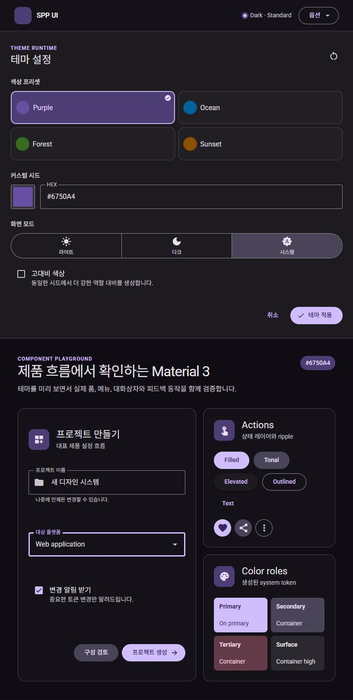
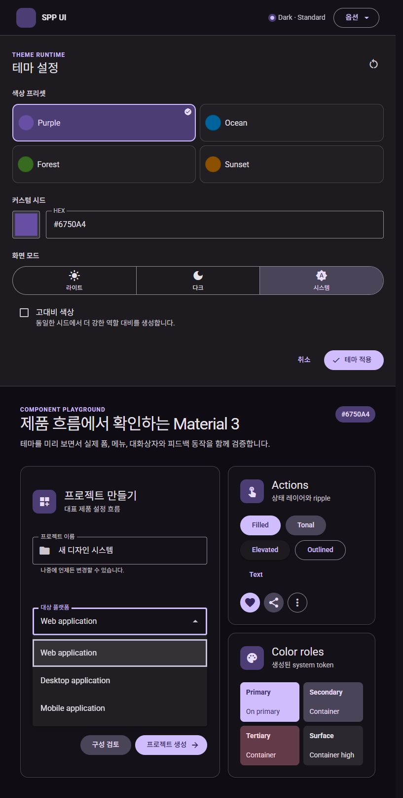
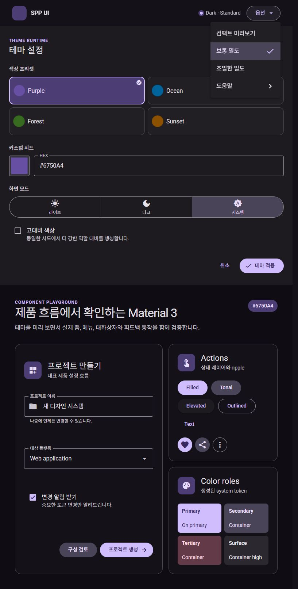
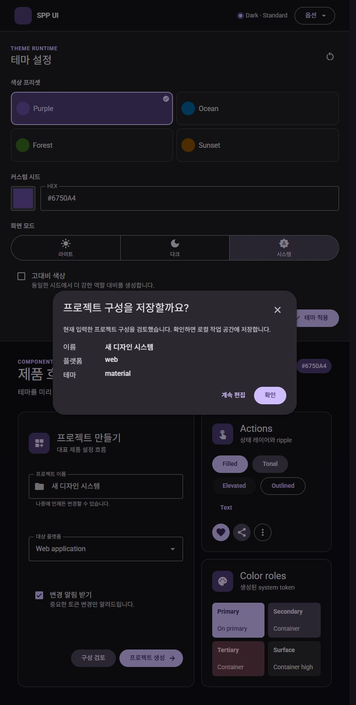
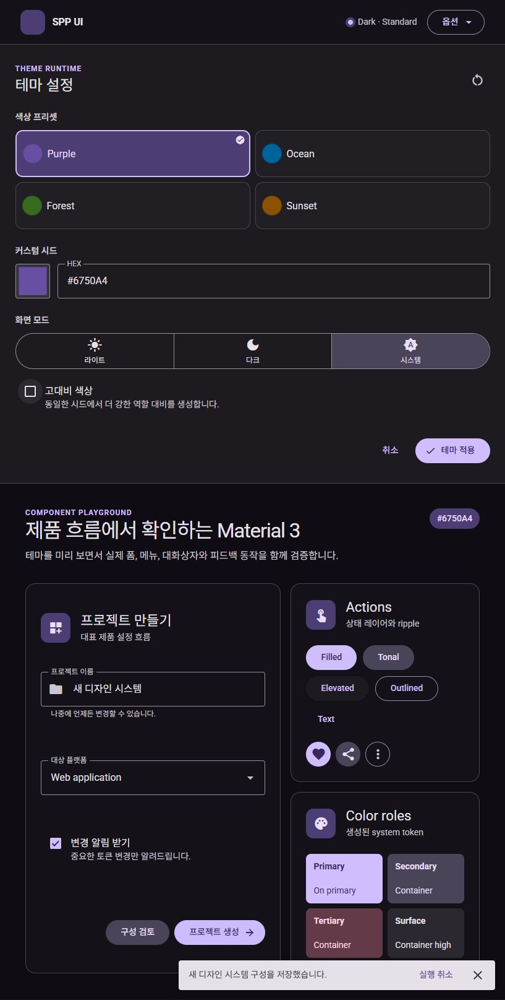
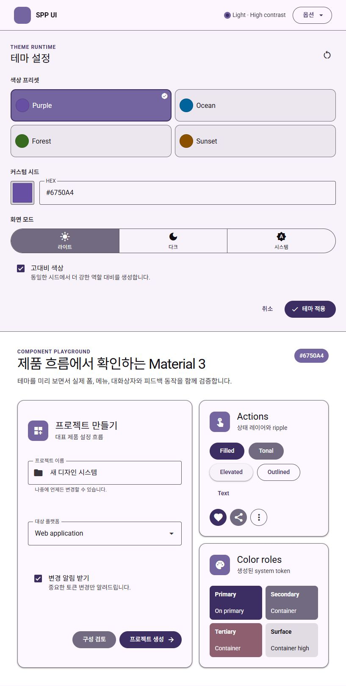

# MD3 / Material Web current compliance audit

관찰일: 2026-08-26

## 결론

현재 구현은 기본 anatomy, typography, color role, shape, elevation, 주요 motion과 React/Base UI semantics를 상당 부분 맞췄다. 하지만 프로젝트의 엄격한 M3 Web 준수 정책으로는 `PASS`가 아니라 `IN_REVIEW`가 맞다.

내부 감사 환산 점수는 약 **74/100**이다. 이 점수는 공식 인증이 아니라 현재 코드, 실제 Vite 화면, 공식 Material Web stable source, 자동 검증 범위를 합친 우선순위 지표다.

> 후속 개선 상태: 이 문서의 발견 항목은 최초 감사 시점의 증거로 보존한다. 이후 P1/P2 코드 조치를 적용했으며, governance가 정의한 상태가 `PASS | BLOCKED`이므로 현재 기계 판독 상태는 실제 AT/forced-colors 게이트가 남은 `BLOCKED`다. `BLOCKED`는 구현 실패가 아니라 미완료된 실환경 준수 증거를 뜻한다.

- 기본 시각/anatomy: 높음
- reference → system → component token 계층 무결성: 높음
- interaction/state parity: 중간 이상
- Material Web 공식 component token API 호환성: 낮음~중간
- 실제 AT/forced-colors 근거와 compliance traceability: 미완료

## 실제 화면 단계

1. 기본 Theme Lab — 양호. Button, IconButton, TextField, Checkbox, Select의 기본 anatomy와 Dark/Standard 역할 색상이 안정적이다.

   

2. Select 열림 — 개선됨. field와 menu가 zero-offset으로 연결되고 56px option과 현재 option focus가 보인다. Option ripple은 없다.

   

3. Menu 열림 — 부분 준수. 48px item, 24px trailing icon, selected container는 맞지만 item에 Material Web list/menu item의 ripple과 inward focus ring이 없다.

   

4. Dialog — 양호. scrim, surface, title/supporting typography, action alignment와 dialog semantics가 확인된다.

   

5. Snackbar — 단일 행은 양호. inverse surface/action color와 action/dismiss interaction은 연결됐다. 두 줄 anatomy와 실제 screen reader announcement는 미검증이다.

   

6. Light / High contrast — 시각 역할 분리는 양호. 이는 MCU contrast level 0.5 결과이며 Windows forced-colors 검증을 대체하지 않는다.

   

## 강점

- `src/ui` CSS 전체에서 custom property 583개를 정의하고 524개를 소비하며, 해석되지 않은 `--md-*` 참조는 0개다.
- component/interactions CSS에서 `--md-sys-*` 직접 참조와 hard-coded color literal은 각각 0개다.
- Material Web v2.5.0 snapshot과 현재 `main`의 대상 docs 차이는 freshness metadata뿐이며 Usage/Theming/API 본문 drift는 없었다.
- Button과 IconButton은 공통 StateLayer, pointer/keyboard Ripple, FocusRing을 사용한다.
- TextField/Select의 measured floating label, layered outline, supporting/error text 위치와 Select/Menu placement motion은 실제 화면과 코드에 연결돼 있다.
- `pnpm.cmd verify`가 structure, lint, typecheck, Vitest 7 tests, Vite build, Storybook build를 통과했다.

## 주요 발견

### P1 — Menu/Select option/Checkbox interaction primitive 불완전

Stable Material Web의 Checkbox, Menu item, Select option은 ripple과 focus ring을 렌더링한다. 현재 Button/IconButton/Snackbar action은 공통 primitive를 사용하지만 Checkbox, Menu item, Select option은 사용하지 않는다.

- Checkbox: hover/focus/pressed state layer와 mark motion은 있으나 press ripple이 없다.
- Menu item: `data-highlighted` 배경만 있고 ripple, pressed state, inward focus ring이 없다.
- Select option: focus state layer와 inset box-shadow는 있으나 ripple이 없다.

이는 프로젝트 계약의 "모든 interactive root는 StateLayer와 FocusRing을 사용하고 필요한 press feedback은 Ripple을 사용" 규칙과 일치하지 않는다.

### P1 — compliance manifest가 governance record 계약보다 약함

governance의 `M3ComplianceRecord`는 per-component main/snapshot URL, `verifiedAt`, `checkedAreas`, `deviations`를 요구한다. 실제 manifest interface는 component, URL 일부, 상태와 blocker만 기록한다. 또한 Select는 direct M3 URL이 비어 있고 8개 항목 모두 `IN_REVIEW`다.

결과적으로 현재 manifest는 구현 상태 표시는 가능하지만, anatomy부터 accessibility까지 무엇을 확인했는지 기계적으로 증명하지 못한다.

### P1 — 공개 경계에 Base UI와 내부 bootstrap이 누출됨

- `DialogPrimitive`가 `src/ui/index.ts`에서 공개되어 앱이 `BaseDialog.Close`를 직접 사용한다.
- `src/main.tsx`가 `src/ui/theme/bootstrap-theme`를 deep import한다.

이는 Base UI를 내부 behavior primitive로 제한하고 `src/ui/index.ts`를 유일한 앱-facing entry로 두는 계약과 충돌한다.

### P2 — 공식 component token API 호환성은 제한적

현재 기본값의 토큰 연결은 좋지만 Material Web stable source의 supported component token 이름과 직접 비교하면 약 161/683, **24%**만 동일 이름으로 제공된다. 이는 기본 화면의 시각 준수율이 아니라 외부 소비자가 Material Web token 이름으로 세부 상태를 재정의할 수 있는 범위다.

특히 Menu는 공식 `--md-menu-item-*`/`--md-list-item-*` 대신 프로젝트 전용 `--md-menu-list-item-*`를 사용한다. Checkbox의 selected hover/focus state token 4개는 정의됐지만 실제 CSS가 소비하지 않는다. `Checkbox`, `Select`, `Dialog`, `Menu` 공개 props에는 root `className`/`style`도 없어 instance-level token override가 제한된다.

### P2 — Snackbar 두 줄 token이 정의됐지만 anatomy에 연결되지 않음

`--md-snackbar-two-lines-container-height: 4.25rem`이 존재하지만 Snackbar root는 항상 one-line minimum만 사용한다. 긴 메시지에서 공식 두 줄 container 높이와 spacing을 보장하는 state/story/test가 없다.

### P2 — 검증 행렬이 기본 상태 중심

Linux visual baseline은 Light/Dark × 3 viewport의 닫힌 기본 화면 6장이다. High contrast, forced-colors, open Select/Menu/Dialog, multi-line Snackbar는 visual baseline에 없다. axe와 키보드 E2E는 강한 보조 근거지만 실제 screen reader announcement와 Windows forced-colors를 대체하지 않는다.

## 컴포넌트별 판정

| 컴포넌트 | 현재 건강도 | 주요 남은 항목 |
|---|---|---|
| Button | 양호 | 공식 state token surface 확장, forced-colors 실환경 |
| IconButton | 양호 | selected 접근명 계약과 공식 token surface 확장 |
| TextField | 양호 | state별 공식 token surface, forced-colors/AT |
| Checkbox | 부분 준수 | ripple, state별 token 실제 소비 |
| Select | 부분 준수 | option ripple, direct M3 source, forced-colors/AT |
| Dialog | 양호 | Base UI primitive 공개 누출 제거, AT |
| Menu | 부분 준수 | item ripple, pressed/focus ring, 공식 menu/list token naming |
| Snackbar | 부분 준수 | two-line anatomy, 실제 live announcement |

## 권장 수정 순서

1. Checkbox/Menu item/Select option의 ripple·focus·pressed state를 공식 stable source와 같은 primitive 계약으로 통합한다.
2. governance schema에 맞게 manifest를 확장하고 Select direct source 및 per-area evidence를 채운다.
3. `DialogPrimitive`와 bootstrap deep import를 공개 adapter로 대체해 `src/ui/index.ts` 경계를 복원한다.
4. 공식 token alias 또는 지원표를 추가하고 dead state token과 Snackbar two-line token을 실제 anatomy에 연결한다.
5. forced-colors + 실제 screen reader 조합을 수동 검증한 뒤 blocker-free component만 `PASS`로 승격한다.

## 후속 개선 적용 결과

2026-08-26에 감사의 코드 조치 1~4를 적용했다.

- Checkbox, Menu item, Select option이 공통 `StateLayer`, pointer/keyboard `Ripple`, `FocusRing`을 렌더링한다. Checkbox ripple은 40px state-layer 좌표를 사용하고 Menu/Select focus ring은 surface 안쪽에 표시된다.
- Checkbox selected hover/focus/pressed container·state token이 실제 CSS 상태에 연결됐다. Menu는 프로젝트 전용 `--md-menu-list-item-*` 대신 공식 Material Web의 `--md-menu-item-*`와 `--md-list-item-*` 계열을 소비한다.
- Snackbar는 description의 실제 line box를 `ResizeObserver`로 판정해 두 줄일 때 `--md-snackbar-two-lines-container-height` 68px를 적용한다. Storybook과 실제 앱의 토큰 가이드 흐름에 두 줄 state를 추가했다.
- `DialogPrimitive` 공개 export를 프로젝트 소유 `DialogClose` adapter로 바꾸고, pre-React bootstrap은 `applyInitialTheme`로 `src/ui/index.ts`에서 노출했다. 구조 validator가 앱의 `src/ui/**` deep import와 내부 Dialog namespace 재노출을 차단한다.
- manifest는 `m3WebUrl`, main/snapshot docs, `verifiedAt`, `checkedAreas`, `deviations`, `status`를 포함한다. Select는 M3 Text field + Menu의 composite 근거를 명시하고, 8개 항목 모두 실환경 blocker 때문에 정직하게 `BLOCKED`를 유지한다.
- 공개 `Checkbox`, `Select`, `Dialog`, `Menu`에 root `className`/`style` override가 추가됐다. Menu item은 optional leading icon을 제공하며 24px list-item token을 사용한다.
- 회귀 사양은 Vitest 3 suites/9 tests와 Chromium/Firefox/WebKit 실제 Vite E2E 24 tests에서 통과했다. Checkbox/Menu/Select interaction과 two-line Snackbar가 이 흐름에 포함된다.
- 체크박스 공통 interaction layering에 따른 7-pixel 렌더링 차이를 검토한 뒤, 정책 명령인 `pnpm test:visual:update`로 Light/Dark x 3 viewport의 6개 Linux 기준 이미지를 갱신했다. 갱신 후 비교 결과는 6건 PASS이며 총량은 739,486 bytes다.
- 최종 `pnpm verify`는 structure, lint, typecheck, Vitest, Vite build, Storybook build 전체를 통과했다.

남은 항목은 Windows forced-colors와 실제 screen reader announcement, 그리고 기존 6개 foundation visual baseline 밖의 overlay/high-contrast 전용 이미지 범위다. 이 항목을 완료하기 전 manifest를 `PASS`로 승격하지 않는다.

## 검증 한계

- standalone Playwright E2E는 Chromium/Firefox/WebKit에서 24건 통과했고, Linux visual baseline은 6건을 정책 절차로 재생성한 뒤 다시 비교했다.
- in-app Browser에서도 실제 Vite 진입점을 통해 Checkbox 18px control/40px ripple, Menu 48px item/24px icon, Select 56px field와 focus/ripple, Snackbar two-line 68px를 DOM readback으로 확인했으며 console warning/error는 없었다.
- 스크린샷과 axe로 실제 screen reader announcement 또는 Windows forced-colors 동작을 확정하지 않았다.
