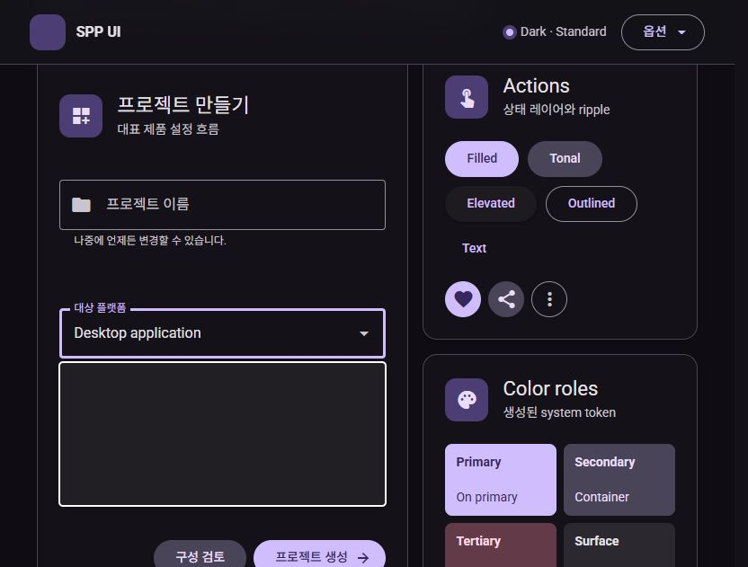
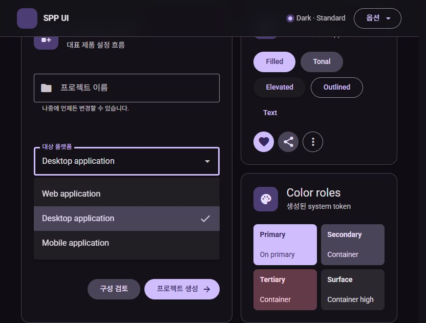

# Select 반복 열림 회귀 수정

관찰일: 2026-08-26  
대상: 실제 Vite Theme Lab (`http://localhost:5173/`)  
환경: Windows in-app Browser, Dark/Standard, `prefers-reduced-motion: reduce`

## 결론

Select를 닫았다 다시 열면 option DOM은 남아 있지만 computed opacity가 모두 `0`이 되어 빈 surface로 보이는 회귀를 실제 사용자 탭에서 재현했다. 닫힘 animation의 `fill: forwards` 상태를 다음 열림에서 취소하고 Material Web open sequence를 다시 시작하도록 공용 menu motion 수명주기를 수정했다.

## 검토 단계

1. **반복 열림 전 — 실패.** `Desktop application` 선택 후 다시 연 popup에서 option 3개의 computed opacity가 `0/0/0`이었다. 구조와 accessible option은 존재하지만 사용자가 항목을 볼 수 없었다.
2. **두 번째 열림 — 양호.** 수정 후 같은 상태에서 다시 열었을 때 Web/Desktop/Mobile option이 모두 표시되고 computed opacity가 `1/1/1`로 완료됐다.
3. **세 번째 열림 — 양호.** 다시 닫고 여는 추가 반복에서도 computed opacity `1/1/1`과 field 아래 배치가 유지됐다.

## 화면 증거

### 1. 수정 전 반복 열림

### 2. 수정 후 두 번째 열림

## 회귀 방지

- 공용 `useMaterialMenuMotion`이 `data-ending-style`과 `data-open`을 모두 관찰한다.
- close 진입 시 현재 open animation을 취소하고 150ms close sequence를 시작한다.
- 같은 popup node가 다시 open 되면 fill state를 포함한 close animation을 취소하고 500ms open sequence를 재시작한다.
- 실제 Vite E2E 계약에 두 번째 열림의 option 3개 visibility와 computed opacity `1/1/1` 검증을 추가했다.

## 접근성 및 검증 한계

반복 열림 뒤 option의 accessible name과 listbox 구조는 실제 DOM snapshot에서 유지됐다. 이번 화면 검증만으로 screen reader announcement와 forced-colors 준수 여부는 판정하지 않았으며, 두 항목은 기존 준수 게이트로 남아 있다.
