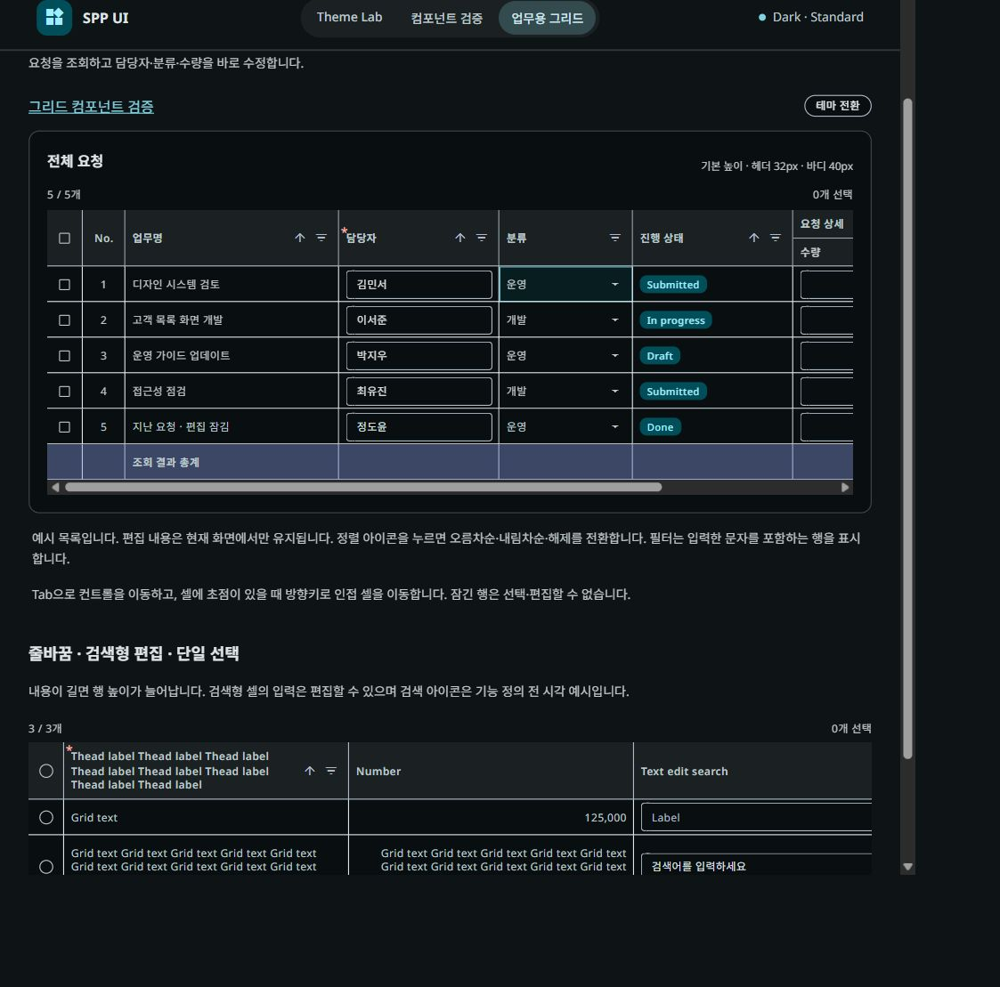

# CI 재점검과 메뉴 내부 스크롤 교정

## 실패 점검

- 대상은 `ba6ede17ad28fd1f34d63a346deee0bf14e3ed1b`의 [CI 실행](https://github.com/clt-joshua/spp-ui-frontend/actions/runs/35038755411)이다. 최초 WebKit 실행은 Button 키보드 상태 검사와 TextField large/small hover 검사에서 30초 시간 초과로 실패했다.
- 같은 커밋의 Windows 및 CI와 동일한 Linux 이미지 집중 검사는 각각 3/3 PASS였다. GitHub 실패 작업 재실행도 WebKit **76/76 PASS, 재시도 없음**이다. 원래 세 시간 초과의 원인은 재현하지 못했으므로 제품 코드 결함 또는 특정 환경 원인으로 단정하지 않는다.
- 재실행 성공으로 기존 CI → [Cloudflare Pages 자동 배포](https://github.com/clt-joshua/spp-ui-frontend/actions/runs/37381551278)가 복구됐다.
- 별도 Linux 전체 실행은 **75 PASS / 1 FAIL**이었다. DataGrid에서 분류 ‘운영’을 클릭해도 ‘디자인’이 유지됐다. 위 원격 결과와 합산하거나 전체 PASS로 표시하지 않는다.

## 확인한 원인과 수정

- 그리드 실패 trace의 옵션 클릭 직전 메뉴 표면 `scrollTop`은 84px, 클릭 직후에는 40px이었다. 펼쳐지는 높이가 바뀌는 동안 native scroll-into-view가 `overflow: hidden` 영역을 스크롤해 눌렀던 옵션의 위치가 이동했다.
- 공통 `useMaterialMenuMotion`의 전환 중 표면만 `overflow: clip`으로 변경했다. 전환 종료·취소 시 기존 overflow 복원은 유지하므로 열린 메뉴의 정상 스크롤은 보존한다.
- Select, AutoComplete, Menu, GridSelect가 같은 수정 경로를 사용한다. Figma 토큰, 모션 시간·easing·높이 애니메이션, 공개 API, DataGrid 구현과 14개 목록은 유지한다.
- 기존 실제 앱 모션 검사에 native 스크롤 요청 후 내부 `scrollTop`이 0으로 유지되는 회귀 검사를 추가했다. 수정 전 `index-DyufvDWE.js`에서 이 검사가 FAIL인 것을 확인했다. 검사를 완화하거나 hover/click을 강제 처리하지 않았다.

## 수정 산출물 검증

- `pnpm verify` PASS: 구조·lint·TypeScript·12 suites / 53 unit·Vite·Storybook.
- 수정 산출물: `index-DsOmTds7.js` / `index-BHct_3ud.css`. JS SHA-256: `956fc0aa22f2c594c02dc4905c678199e9c6d6c05f3b5d2fb450b509a4e46c6f`.
- 영향 범위 Chromium/Firefox/WebKit **39/39 PASS**, retries 0. Button, TextField, DataGrid 옵션 선택, Select/AutoComplete 위쪽 배치·disabled 옵션, 4개 테마의 Menu 피드백을 포함한다.
- CI와 동일한 pinned Linux 이미지·Xvfb headed WebKit의 기존 실패 3건과 모션 회귀·위쪽 배치·그리드 선택은 **6/6 PASS**, retries 0.
- 실제 앱 내 브라우저에서 수정 JS를 확인한 뒤 공통 헤더 → `/grid` → REQ-001 분류 열기 → ‘운영’ 클릭 → 닫힌 combobox의 ‘운영’ 값과 포커스 복귀를 확인했다. page error 0.
- GitHub의 최종 CI와 공개 배포는 수정 커밋을 푸시한 뒤 해당 SHA·산출물로 별도 확인한다. 수동 스크린리더/Windows Contrast Themes 미검증 상태는 유지한다.

